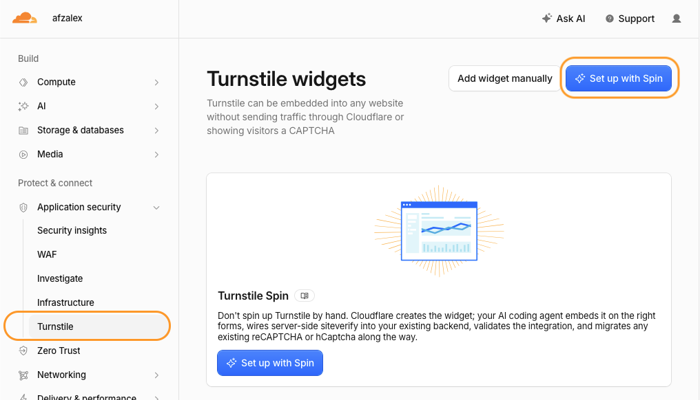
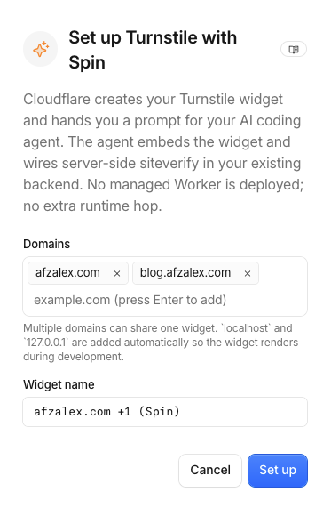
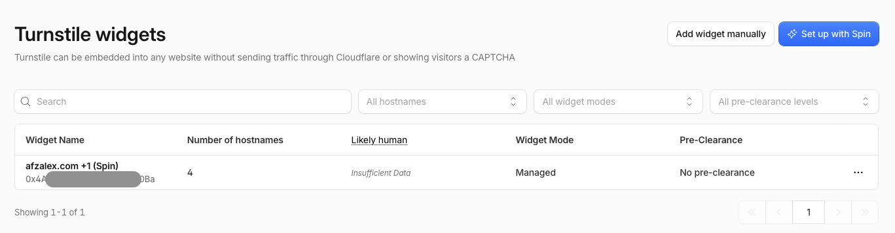
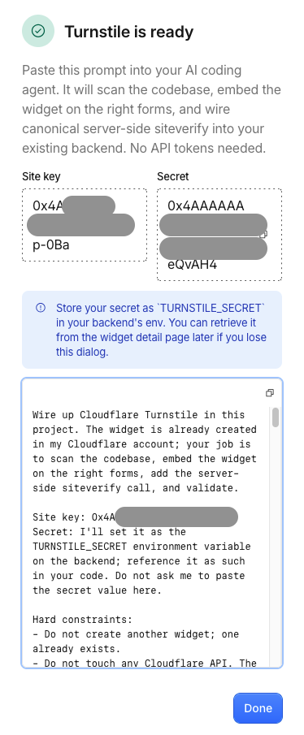

CAPTCHAs are supposed to separate legitimate visitors from automated abuse. Too often, they also make legitimate visitors stop, squint at a grid of images, and prove that a corner of a traffic light counts as a traffic light.

I wanted a quieter check for my website.

[Cloudflare Turnstile](https://developers.cloudflare.com/turnstile/) is a CAPTCHA alternative that evaluates signals in the visitor's browser and issues a short-lived token. In most cases, the check finishes without a puzzle. When Cloudflare needs an interaction, it can display a simple checkbox.

Turnstile is useful anywhere a website needs to protect an action:

- contact and feedback forms;
- account registration and login;
- password-reset requests;
- comments and community submissions;
- checkout and reservation flows;
- surveys, voting, and other public actions;
- API requests initiated by a browser.

It is convenient to describe this as checking whether a visitor is human, but that is not a literal guarantee. Turnstile evaluates the interaction and gives the backend evidence it can verify. The backend still decides whether the protected action may continue.

## The complete check has two halves

The visible widget is only the first half of the security model:

```text
Browser
  → Turnstile widget
  → short-lived token
  → application backend
  → Cloudflare Siteverify
  → accept or reject the protected action
```

The browser obtains a token. The backend verifies it with Cloudflare.

If a site displays the widget but never verifies its token on the server, an automated client can skip the page and call the unprotected endpoint directly. The green checkmark is useful feedback for the visitor; Siteverify is what makes it enforceable.

Turnstile tokens expire after five minutes and can be used only once. A page that stays open after submission should reset its widget before allowing another attempt.

## Create a widget with Spin

In the Cloudflare dashboard, I opened:

```text
Protect & connect
→ Application security
→ Turnstile
```

The dashboard offered **Add widget manually** and **Set up with Spin**. Spin creates the widget and produces a structured prompt that an AI coding agent can use to scan the project, place the widget, add server-side validation, and check the integration.



I selected **Set up with Spin** and entered the hostnames where the widget would appear:

```text
afzalex.com
blog.afzalex.com
```

I kept the managed widget mode. This lets Cloudflare choose how much interaction is appropriate for a request instead of forcing the same puzzle on everybody.



After setup, the widget appeared in the dashboard with its hostnames, managed mode, and analytics fields.



## The site key and secret have different jobs

Cloudflare then displayed two credentials:

- the **site key** identifies the widget in browser markup;
- the **secret** authenticates the backend when it calls Siteverify.



The site key is public by design. Anyone can inspect it in the page source.

The secret is not public. It should be stored in the backend's secret manager or environment as:

```text
TURNSTILE_SECRET
```

It must never be placed in client-side JavaScript, committed to the repository, copied into a public environment variable, or published in a screenshot.

## Embed Turnstile on the protected action

For a conventional form, the browser-side integration can be compact:

```html
<script
  src="https://challenges.cloudflare.com/turnstile/v0/api.js"
  async
  defer
></script>

<form action="/submit" method="post">
  <!-- Existing form controls -->

  <div
    class="cf-turnstile"
    data-sitekey="<YOUR_SITE_KEY>"
    data-action="turnstile-spin-v2"
  ></div>

  <button type="submit">Submit</button>
</form>
```

Turnstile adds a hidden field named:

```text
cf-turnstile-response
```

That field contains the token. It travels with the rest of the form data to the backend.

The `data-action` value gives the token a purpose. I used `turnstile-spin-v2` because that was the action specified by the Spin integration. A larger application could use stable actions such as `login`, `register`, or `comment` and require the matching value on the server.

## Verify the token on the server

The backend reads the token and calls Cloudflare's canonical Siteverify endpoint:

```js
const token = formData.get("cf-turnstile-response");

const verificationResponse = await fetch(
  "https://challenges.cloudflare.com/turnstile/v0/siteverify",
  {
    method: "POST",
    headers: {
      "Content-Type": "application/x-www-form-urlencoded",
    },
    body: new URLSearchParams({
      secret: env.TURNSTILE_SECRET,
      response: token,
      remoteip: clientIp,
    }),
  },
);

const result = await verificationResponse.json();
```

The protected action should continue only after verification:

```js
if (
  result.success !== true ||
  result.action !== "turnstile-spin-v2" ||
  result.hostname !== "blog.afzalex.com"
) {
  return new Response("Forbidden", { status: 403 });
}

// The application's existing protected action runs here.
```

Checking the additional fields matters:

- `success` says Cloudflare accepted the token;
- `action` connects it to the intended operation;
- `hostname` connects it to the expected website.

I also reject missing or unusually long tokens, use a timeout for Siteverify, validate the form data independently, and return a generic error when verification fails. Turnstile protects the action from automated abuse; it does not replace ordinary input validation, authorization, rate limiting, or application security.

## A static website still needs a backend boundary

My Astro blog is statically generated and hosted on GitHub Pages. Its original form used browser JavaScript only. There was no server-side handler where the Turnstile secret could live.

The Spin instructions correctly stopped at that boundary.

I added a small Cloudflare Worker as the verification endpoint. A Worker is not required specifically; an existing Express route, serverless function, Rails controller, PHP handler, Go service, or another trusted backend can perform the same Siteverify request.

The requirement is architectural, not product-specific:

```text
The browser must not possess the secret.
The protected action must not run before Siteverify succeeds.
```

## The localhost result that initially looked broken

During development, Turnstile displayed **Success!** on:

```text
http://localhost:4321
```

Submitting still failed because my production backend accepted only:

```text
https://blog.afzalex.com
```

This was expected. The browser had received a token, but the production backend rejected the local origin and a token created for the wrong hostname.

The useful distinction is:

```text
Widget success means the browser obtained a token.
Application success means the backend verified and consumed it.
```

For automated tests, Cloudflare provides dedicated test keys. For manual production validation, I tested the complete flow from the deployed hostname instead of weakening production hostname checks.

## What the free plan provides

Cloudflare's current [Turnstile plans](https://developers.cloudflare.com/turnstile/plans/) list these Free-plan allowances:

- up to 20 widgets per account;
- unlimited challenges and verification requests;
- up to 10 configured hostnames per widget;
- managed, non-interactive, and invisible widget types;
- seven days of analytics history.

The backend used to validate tokens can have its own hosting limits and costs. Those are separate from Turnstile itself.

Free allowances can change, so I would check the current documentation before depending on a particular limit for a business-critical system.

## Less friction does not mean less enforcement

The main value of Turnstile is not merely that the widget looks friendlier. It separates the visitor experience from the enforcement decision:

- the browser performs a low-friction challenge;
- the backend independently verifies the result;
- action and hostname checks constrain where the token can be used;
- the application continues only after successful verification.

That pattern works for far more than one form. Any public web action that attracts automated abuse can place Turnstile at the boundary, provided the application completes the server-side half.

The result is a better tradeoff: bots meet a real verification gate, while legitimate visitors usually see little more than a quiet green checkmark.
