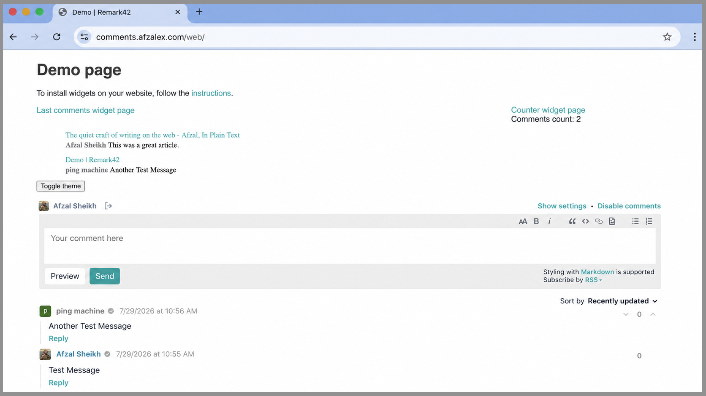
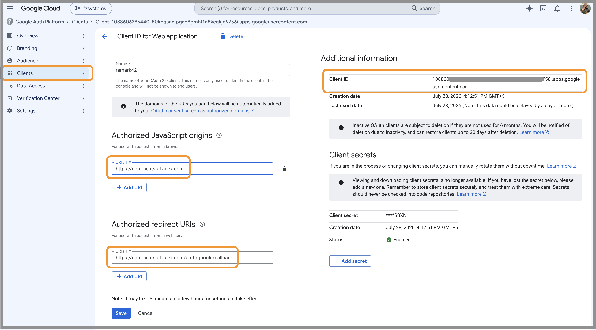
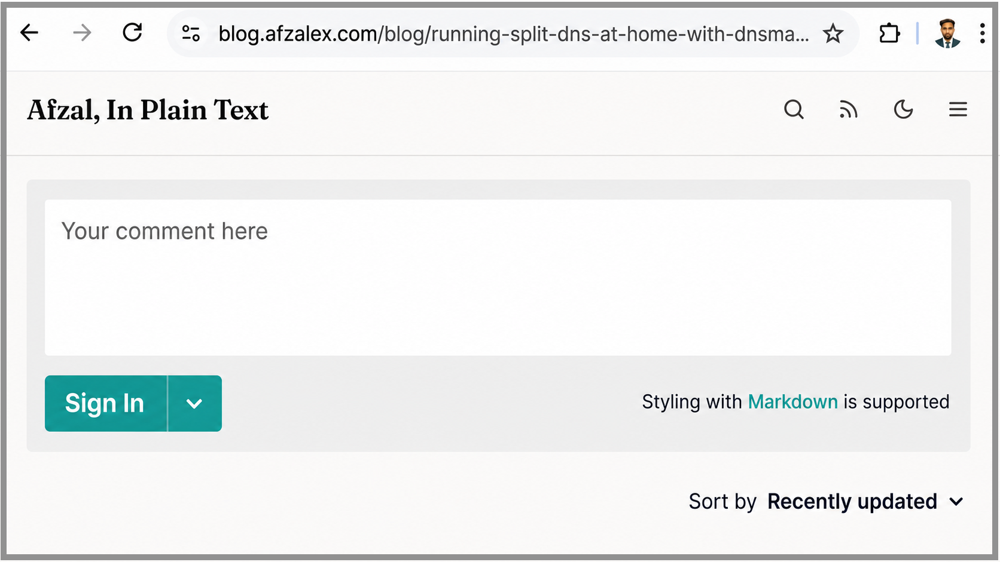
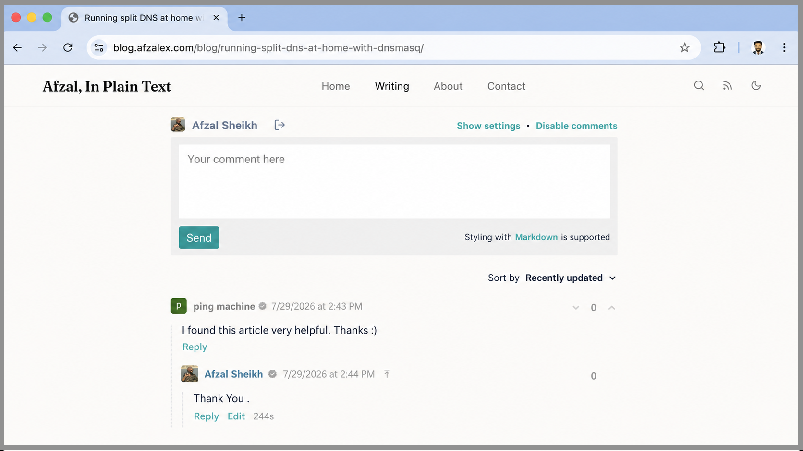

A static website is pleasantly simple until it needs to remember something.

My Astro blog could publish articles without an application server, but a real comments section needed more: persistent storage, authentication, moderation, and a backend that could accept writes without turning the blog itself into a dynamic application.

I added those capabilities with [Remark42](https://remark42.com/), an open-source, self-hosted commenting system. The blog remains statically generated. Remark42 runs separately in Docker, stores the discussions, handles Google sign-in, and renders the comment interface inside each article.

The finished arrangement is straightforward:

1. A reader opens a static article on `blog.afzalex.com`.
2. The article loads its comment interface from `comments.afzalex.com`.
3. Remark42 handles Google authentication, comments, replies, moderation, and
   storage.

This separation is the part I like most. The website stays fast and portable, while the stateful feature has a small service of its own.

## What the setup requires

Before starting, I needed:

1. a server capable of running Docker;
2. a domain and a `comments` subdomain;
3. a reverse proxy such as Traefik;
4. a persistent directory for Remark42 data;
5. a Google OAuth web application;
6. a place in the article template where the widget can be embedded.

Remark42's [installation guide](https://remark42.com/docs/getting-started/installation/) covers Docker and binary deployments. I used Docker directly rather than Docker Compose because that matches the way I run small services on my home server.

## Give the service its own hostname

I created `comments.afzalex.com` for Remark42. If you are following this with
your own domain, use the equivalent hostname—for example,
`comments.example.com`—and substitute it at this point. From here onward, I
will use `comments.afzalex.com`, the hostname from my working setup.

The DNS record should resolve to the server or public reverse proxy that will receive the request. Remark42 itself can remain reachable only on the Docker network; Traefik becomes its public entry point.

During local testing, a hosts-file entry or a local DNS resolver can point the hostname to a private address. I use dnsmasq on my network, but Remark42 does not depend on dnsmasq. It only needs the configured hostname to reach the correct reverse proxy.

My blog is available at `blog.afzalex.com`; on another domain that might be
`blog.example.com`. Keeping the blog at `blog.afzalex.com` and Remark42 at
`comments.afzalex.com` places both services under the same parent domain.

That detail matters for Google sign-in. Remark42 authentication uses a secure cookie. When I initially embedded the service across unrelated parent domains, the browser treated that cookie as third-party state and sign-in worked only after third-party cookies were allowed. Using subdomains of the same domain avoids that fragile dependency.

Remark42 documents the relevant cookie and embedding behavior in its guide to [running the instance on a separate domain](https://remark42.com/docs/manuals/separate-domain/).

## Configure Remark42

I keep the public settings and secrets in an environment file outside the website repository:

```dotenv
REMARK_URL=https://comments.afzalex.com
SITE=afzal-blog
SECRET=replace-with-a-long-random-value

AUTH_GOOGLE_CID=replace-with-google-client-id
AUTH_GOOGLE_CSEC=replace-with-google-client-secret

AUTH_ANON=false
AUTH_EMAIL_ENABLE=false
ALLOWED_HOSTS='self',https://blog.afzalex.com
TIME_ZONE=Asia/Kolkata
```

The important values are:

| Setting            | Purpose                                                |
| ------------------ | ------------------------------------------------------ |
| `REMARK_URL`       | The public URL of the Remark42 service                 |
| `SITE`             | The logical site whose discussions are stored          |
| `SECRET`           | A long, stable secret used to sign authentication data |
| `AUTH_GOOGLE_CID`  | The Google OAuth client ID                             |
| `AUTH_GOOGLE_CSEC` | The Google OAuth client secret                         |
| `ALLOWED_HOSTS`    | The origins allowed to embed the comment interface     |

`REMARK_URL` must match the `host` used by the frontend. `SITE` must match its `site_id`. A mismatch can load the JavaScript successfully while still pointing the widget at the wrong discussion database.

I generated the application secret once:

```bash
openssl rand -hex 32
```

It should be saved and reused. Generating a different value whenever the container starts would invalidate existing authentication sessions. The environment file contains private credentials, so I keep it out of Git and restrict its filesystem permissions.

One Remark42 instance can serve more than one site:

```dotenv
SITE=afzal-blog,afzal-main
```

Each frontend then selects one of those values through `site_id`. Remark42 keeps the sites logically separate even though the same process serves them.

The full set of options is available in the official [configuration parameter reference](https://remark42.com/docs/configuration/parameters/).

## Run Remark42 with `docker run`

I created a persistent service directory and attached the container to the same Docker network as Traefik:

```bash
mkdir -p remark42/var

docker run -d \
  --name remark42 \
  --restart unless-stopped \
  --network web \
  --env-file "$PWD/remark42/remark42.env" \
  -v "$PWD/remark42/var:/srv/var" \
  ghcr.io/umputun/remark42:latest
```

Replace `web` with the network used by the reverse proxy. In my setup, the container is named `fzremark42` and joins `fznetwork`.

I do not publish port `8080` directly in this production-style example. Traefik reaches that port through the shared Docker network, while external clients use the HTTPS hostname.

Remark42 uses its embedded Bolt store by default. The database files, uploaded images, avatars, and automatic backups live below `/srv/var`, so that mount is the important persistence boundary. Remark42 also creates daily comment exports under the backup directory by default. I include the mounted directory in the server's normal backup routine; the official documentation explains the [automatic and manual backup options](https://remark42.com/docs/backup/backup/).

If you prefer Compose, start with Remark42's maintained
[`docker-compose.yml`](https://github.com/umputun/remark42/blob/master/docker-compose.yml)
and follow the official [installation
guide](https://remark42.com/docs/getting-started/installation/) for the values
that need to be customized.

## Route the subdomain with Traefik

My Traefik dynamic configuration routes the dedicated hostname straight to the Remark42 container:

```yaml
http:
  routers:
    remark42:
      rule: Host(`comments.afzalex.com`)
      service: remark42-service

  services:
    remark42-service:
      loadBalancer:
        servers:
          - url: "http://fzremark42:8080"
```

There is no path prefix to strip. The browser requests `/web/`, `/auth/`, and `/api/` directly from `comments.afzalex.com`, and Traefik forwards those paths unchanged.

The reverse proxy and container must share a Docker network, and the certificate presented by Traefik must cover the comments hostname. For local-only testing, a locally trusted certificate can be used if HTTPS is required.

## Verify that Remark42 is running

Open [`https://comments.afzalex.com/web/`](https://comments.afzalex.com/web/)
to verify the installation. The page should display Remark42's built-in demo,
comment editor, counter, and recent-comments widget.

A lightweight health check is also available:

```bash
curl -fsS https://comments.afzalex.com/ping
```

The expected response is `pong`.



Testing the service independently made the remaining work easier. If `/web/` cannot load, the problem is still in DNS, TLS, the reverse proxy, the Docker network, or Remark42 configuration—not in Astro.

## Add Google authentication

Remark42 supports several authentication providers. I enabled only Google because I wanted visitors to use an existing identity and did not want anonymous comments.

In the Google OAuth web application, the two important URLs are:

- **Authorized JavaScript origin:** `https://comments.afzalex.com`
- **Authorized redirect URI:**
  `https://comments.afzalex.com/auth/google/callback`

The origin and callback belong to Remark42, not to the blog, because Remark42 starts the login flow and receives Google's response.



The resulting credentials go into:

```dotenv
AUTH_GOOGLE_CID=your-client-id
AUTH_GOOGLE_CSEC=your-client-secret
```

Google's client secret must remain on the server. It should never be placed in Astro source, browser JavaScript, a public environment variable, or a screenshot.

The exact Google Cloud screens can change, so I followed Remark42's current [Google authorization instructions](https://remark42.com/docs/configuration/authorization/#google) rather than reproducing the entire account-level workflow here.

After updating the environment file, I recreated the container and confirmed that the Sign In menu offered Google.

## Add comments to your website

Remark42 renders inside a target element placed wherever the comments should
appear:

```html
<div id="remark42">Comments loading…</div>
```

The loading text remains visible only until Remark42 replaces the contents.

The page also needs the frontend configuration. The `host` must match
`REMARK_URL`, while `site_id` must be one of the values configured through
`SITE`:

```html
<script>
  var remark_config = {
    host: "https://comments.afzalex.com",
    site_id: "afzal-blog",
    url: window.location.origin + window.location.pathname,
    page_title: document.title,
    components: ["embed"],
    locale: "en",
    theme: "light",
    show_email_subscription: false,
    show_rss_subscription: false,
    simple_view: true,
    no_footer: true,
  };
</script>
```

Immediately after it, Remark42's official loader adds the required frontend
component:

{/* prettier-ignore */}
```html
<script>!function(e,n){for(var o=0;o<e.length;o++){var r=n.createElement("script"),c=".js",d=n.head||n.body;"noModule"in r?(r.type="module",c=".mjs"):r.async=!0,r.defer=!0,r.src=remark_config.host+"/web/"+e[o]+c,d.appendChild(r)}}(remark_config.components||["embed"],document);</script>
```

My website is built with Astro, so I placed the target element, configuration,
and loader in the article template. I used Astro's `is:inline` directive on
both script tags so the browser receives the configuration and official loader
as ordinary inline scripts. Other static-site generators can place the same
HTML in their article layout or template.

The `url` property identifies the discussion with
`window.location.origin + window.location.pathname`.

Every article path therefore gets its own thread, while query strings and fragments do not accidentally split the conversation. If an application uses query parameters to identify genuinely different content, it should define a different stable URL rule.

The official [frontend configuration reference](https://remark42.com/docs/configuration/frontend/) documents the other display options, and Remark42 also provides a dedicated [Astro integration guide](https://remark42.com/docs/manuals/integration-with-astro/).

Before signing in, the embedded widget displays the editor and authentication control:



After Google authentication, the same area shows the visitor's identity and enables submission. The screenshot at the top of this article shows that authenticated state with a published comment.

## Make the first account an administrator

Authentication lets a user comment; it does not automatically make that user a moderator.

After my first Google login, I clicked the displayed username to find the Remark42 user ID, then added it to the server environment:

```dotenv
ADMIN_SHARED_ID=google_replace-with-the-full-user-id
```

After recreating the container, the account received moderation controls such as:

- disabling comments for one page;
- blocking or hiding abusive users;
- deleting inappropriate comments;
- opening the settings interface.

Remark42 documents this process in its [admin UI guide](https://remark42.com/docs/manuals/admin-interface/). A user ID is configuration rather than a password, but I still avoid publishing my complete identifier unnecessarily.

## Test the full conversation

I tested the feature as a visitor would:

1. open a real article;
2. confirm that the editor loads;
3. sign in with Google;
4. post a short comment;
5. refresh the page and confirm it remains;
6. reply to the comment;
7. confirm that the reply is nested under the original;
8. check the moderation controls with the administrator account;
9. test the same flow in a private browser window.



I also checked the container logs while signing in and posting:

```bash
docker logs --tail 100 remark42
```

That makes it much easier to distinguish an OAuth callback problem from an iframe, cookie, proxy, or storage problem.

## The small details that made it reliable

Most of the setup is straightforward. The failures came from values that looked interchangeable but were not:

- the backend `REMARK_URL` and frontend `host` must be the same public URL;
- the backend `SITE` and frontend `site_id` must match;
- the Google callback must use the Remark42 hostname;
- Traefik and Remark42 must share a Docker network;
- the blog origin must be allowed to frame the widget;
- the storage mounted at `/srv/var` must survive container replacement;
- authentication is more reliable when the blog and comments service share a parent domain.

I also keep the OAuth secret and Remark42 signing secret outside the blog repository, update the container deliberately rather than following an unreviewed image automatically, and back up the persistent directory. When Remark42 sits behind a reverse proxy, its trusted-proxy setting should be limited to the actual proxy network so client-address headers cannot be spoofed.

## A stateful feature without making the site stateful

The blog is still a collection of static files. Remark42 adds the state only
where it belongs:

- **Astro** owns articles and presentation.
- **Remark42** owns identities, comments, replies, and moderation.
- **Traefik** owns the public route.
- **Docker** owns the process boundary.
- **The mounted data directory** owns persistence.

That boundary gives me the interaction I wanted without handing the rest of the website to a hosted commenting platform. Visitors can sign in with Google, conversations persist, replies remain attached to the correct article, and I retain control of the service and its data.

For a static personal site, that feels like the right amount of backend.
