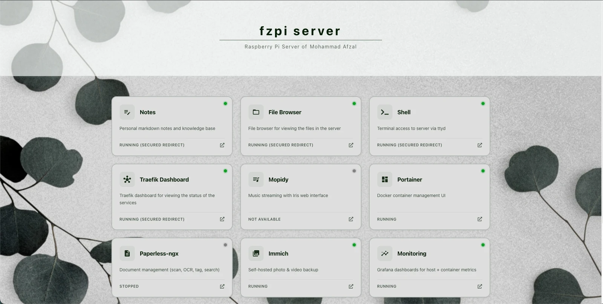
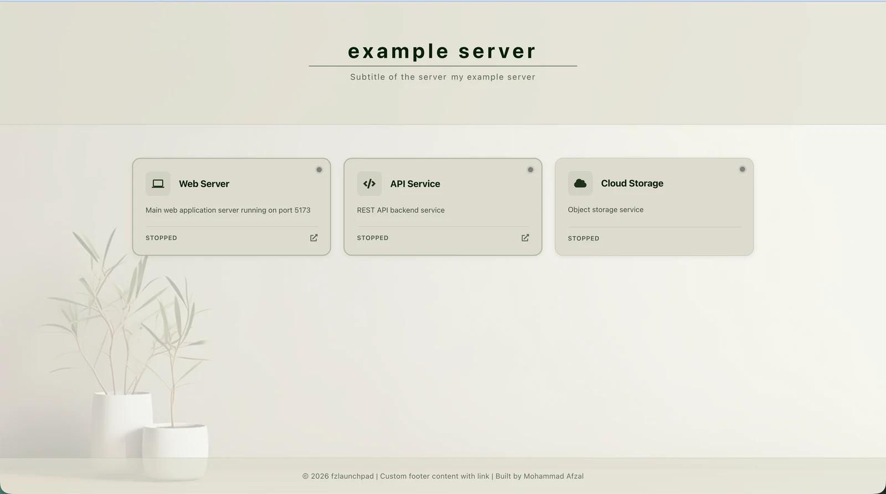
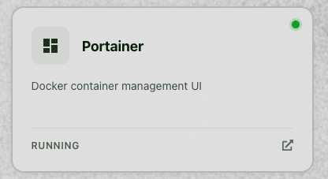
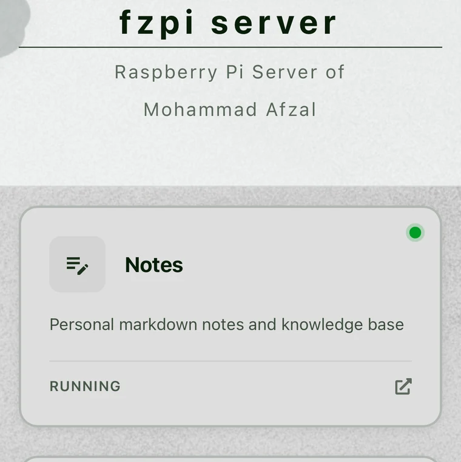

Running several services on one machine creates a surprisingly ordinary
problem: the services may be organized, but their addresses are not.

My Raspberry Pi hosts tools for notes, files, shell access, containers,
documents, photographs, music, and monitoring. Each one has its own URL.
Browser bookmarks helped for a while, but they did not tell me whether a
service was reachable, and they did not give the server a clear front door.

I wanted one page that answered two questions:

1. What is running on this machine?
2. Where do I open it?

That became [fzlaunchpad](https://github.com/afzalex/fzlaunchpad), a small
React and TypeScript dashboard driven by a YAML file. It runs as a static
website, needs no application database, and is available as a ready-to-run
[Docker image](https://hub.docker.com/r/afzalex/fzlaunchpad).



## What I wanted from the dashboard

I did not need another large platform to operate. The dashboard itself should
have almost nothing to maintain.

My requirements were:

- load quickly on a Raspberry Pi and other low-power machines;
- keep service definitions in a readable, versionable file;
- show a clear name, description, icon, link, and current state for each
  service;
- adapt to desktop and mobile screens;
- allow the visual theme to belong to the machine it represents;
- run with one container and sit comfortably behind any reverse proxy.

This led to the most important design decision: fzlaunchpad is
**static-first**. Vite builds the React application, and Caddy serves the
compiled files from a small container. In the visitor's browser, the
application loads `config.yaml`, renders the service cards, and runs any
configured health checks.

There is no separate API for managing the dashboard. Updating it means editing
the YAML file.

## Start fzlaunchpad with Docker

The quickest way to see the default dashboard is:

```bash
docker run -d \
  --name fzlaunchpad \
  --restart unless-stopped \
  -p 8080:80 \
  afzalex/fzlaunchpad:latest
```

It becomes available at:

```text
http://localhost:8080
```

For a real installation, I keep the configuration and background images
outside the container:

```bash
mkdir -p fzlaunchpad/images
cd fzlaunchpad
```

After creating `config.yaml`, I mount both locations read-only:

```bash
docker run -d \
  --name fzlaunchpad \
  --restart unless-stopped \
  -p 8080:80 \
  -v "$PWD/config.yaml:/usr/share/caddy/config.yaml:ro" \
  -v "$PWD/images:/usr/share/caddy/images:ro" \
  afzalex/fzlaunchpad:latest
```

The read-only mounts are deliberate. The container only needs to serve those
files; it does not need permission to change them.

The repository also publishes downloadable static builds and documents a
Compose setup in its [current README](https://github.com/afzalex/fzlaunchpad#readme).

## Describe the dashboard in YAML

Here is a compact configuration with three services. The hostnames use
`example.com`; replace them with addresses that are reachable from the
browsers opening the dashboard.

```yaml
server:
  name: "home server"
  subtitle: "Self-hosted services on {hostname}"

services:
  - name: "Portainer"
    description: "Docker container management"
    icon: "MdDashboard"
    url: "https://portainer.example.com"
    healthCheckUrl: "https://portainer.example.com"

  - name: "Photos"
    description: "Self-hosted photo and video library"
    icon: "MdPhotoLibrary"
    url: "https://photos.example.com"
    healthCheckUrl: "https://photos.example.com"

  - name: "Documents"
    description: "Searchable document archive"
    icon: "MdDescription"
    url: "https://documents.example.com"
    healthCheckUrl: "https://documents.example.com"

footer:
  enabled: true
  content:
    - type: "text"
      content: "Home server · {year}"

theme:
  backgroundImage:
    url: "/images/background.jpg"
    opacity: 1
    position: "center"
    size: "cover"
    repeat: "no-repeat"
  colors:
    background: "#bebfbe"
    cardBackground: "#dedede"
    mediumAccent: "#2d531a"
    darkAccent: "#eeeeee"
    text: "#071e07"
    headerBackground: "#fcfffeaa"
    headerText: "#071e07"
    footerBackground: "#c9c9c9aa"
    footerText: "#071e07"
    serviceStatus:
      "0": "#808080"
      "200-299": "#009d24"
      "300-399": "#3b82f6"
      "400-499": "#ef4444"
      "500-599": "#f59e0b"
      "checking": "#3b82f6"

statusMapping:
  "0": "stopped"
  "200-299": "running"
  "300-399": "redirected"
  "400-499": "error"
  "500-599": "warning"
```

The main parts have distinct jobs:

| Section         | What it controls                                                  |
| --------------- | ----------------------------------------------------------------- |
| `server`        | The machine name, subtitle, and optional header content           |
| `services`      | The cards, links, icons, descriptions, and health-check URLs      |
| `footer`        | Optional text and links at the bottom of the page                 |
| `theme`         | Background image, colours, cards, header, footer, and status dots |
| `statusMapping` | The label shown for each HTTP status code or range                |

The configuration is ordinary text, so I can keep it in Git, review a change,
or reuse it as the starting point for another machine.



## A card is both a link and a small status view

Each service can define two addresses:

- `url` is opened when the card is selected;
- `healthCheckUrl` is requested periodically to determine the displayed
  status.

They can be the same, but they do not have to be. A service might open its
normal user interface while exposing a smaller `/health` endpoint for the
check.

The status label and dot come from the HTTP response. The configuration can
map an individual code or a range, which is useful when a protected service
returns a response such as `401` even though it is running correctly.



The health checks happen in the visitor's browser. That detail has two useful
consequences:

1. the dashboard reports whether the service is reachable from the reader's
   current network;
2. the target service's browser security rules can affect how much information
   the check can read.

fzlaunchpad first attempts a normal CORS request. If the browser blocks access
to the response, it tries a `no-cors` request. A successful opaque request can
confirm basic reachability, but the browser cannot reveal its actual status
code. The interface therefore treats that result as reachable rather than
pretending it has complete monitoring data.

This makes the status indicator a convenient launchpad signal, not a
historical monitoring or incident-alerting system. I still use dedicated
monitoring tools when I need metrics, alerts, or evidence of what happened
while nobody had the dashboard open.

## Make the page belong to the machine

A server dashboard is opened frequently, so small visual choices matter.
fzlaunchpad lets the YAML configuration control:

- the page and card colours;
- header and footer colours;
- a background image, position, size, repeat mode, and opacity;
- colours for exact HTTP codes or status-code ranges;
- icons from Font Awesome and Material Design through React Icons.

It also supports placeholders such as `{hostname}`, `{year}`, `{date}`, and
`{origin}` in names, descriptions, links, and footer content. A configuration
can therefore adapt to the address from which it is loaded without rebuilding
the application.

The theme in my Raspberry Pi installation uses a quiet botanical background
and muted cards. The design is restrained enough that the service names and
states remain the useful part of the page.

## One configuration, responsive cards

I did not want a separate mobile dashboard. The same cards collapse into a
single-column layout, keeping their status, description, and link target.



That matters in practice. I often need the dashboard when I am not already
sitting at a computer—for example, to open a service from my phone or quickly
confirm that a machine is reachable.

## Why this arrangement has stayed useful

fzlaunchpad does not try to discover every container automatically or become
the control plane for the server. Its job is smaller:

- collect the important destinations;
- make their purpose visible;
- show a useful indication of their present state;
- remain easy to replace, move, and configure.

The server continues running exactly as it did before. fzlaunchpad simply
gives it a front page.

That boundary is why the project works well for my setup. A Raspberry Pi, NAS,
VPS, development machine, or small office server can all use the same
application, while the YAML file explains what belongs on that particular
machine.

The source and full configuration reference are available on
[GitHub](https://github.com/afzalex/fzlaunchpad). The ready-made container is
published on [Docker Hub](https://hub.docker.com/r/afzalex/fzlaunchpad), and I
also wrote an earlier [overview on LinkedIn](https://www.linkedin.com/pulse/fzlaunchpad-fast-configurable-launchpad-your-services-mohammad-afzal-e92rc/).

What began as a solution to scattered bookmarks is now the first page I open
when I want to understand a server. One dashboard does not run all my
self-hosted services; it makes all of them easier to find.
