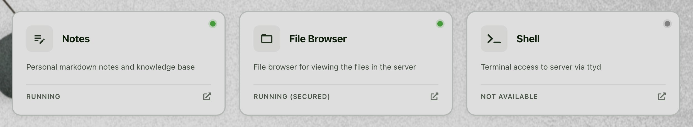
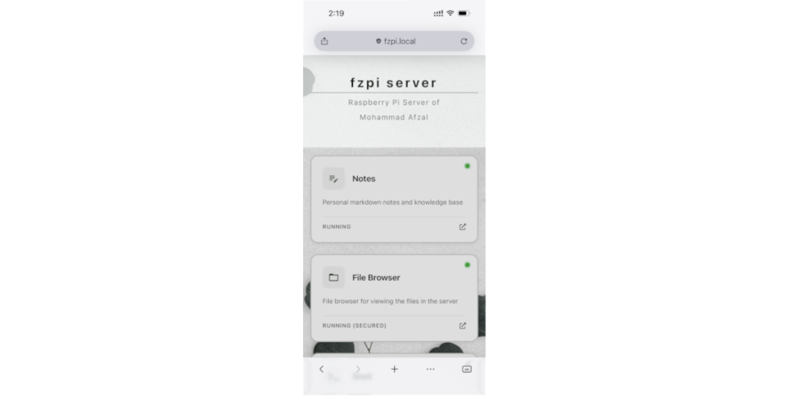

Running several services on one machine creates a surprisingly ordinary
problem: the services stay organized, but their addresses do not.

My Raspberry Pi runs tools for notes, files, shell access, containers,
documents, photos, music, and monitoring. Each one sits behind its own URL,
and for a while a folder of browser bookmarks was the only thing tying them
together. That worked until I needed to know, at a glance, whether a service
was actually up. A bookmark opens a page; it tells you nothing about what is
on the other side of it, and it certainly does not give the server a front
door.

I wanted one page that answered two questions before I clicked anything:

1. What is running on this machine?
2. Where do I open it?

That question turned into [fzlaunchpad](https://github.com/afzalex/fzlaunchpad),
a small React and TypeScript dashboard driven by one YAML file. It runs as a
static site, keeps no database of its own, and ships as a ready-to-run
[Docker image](https://hub.docker.com/r/afzalex/fzlaunchpad).


## Keeping the dashboard itself out of the way

I did not want to introduce another thing to operate. Whatever I built needed
to demand less attention than the bookmarks folder it was replacing, not more.

So the dashboard had to:

- load quickly on a Raspberry Pi and similarly modest hardware;
- keep its service list in a plain, versionable file instead of a database;
- show a name, description, icon, link, and live status for each service;
- work the same on a phone as it does on a monitor;
- let the theme belong to the machine it represents, not to the dashboard;
- run as one container behind whatever reverse proxy is already in front of
  it.

That pushed me toward a static-first design. Vite builds the React app, and
Caddy serves the compiled files from a small container. Everything that looks
dynamic — loading `config.yaml`, rendering the cards, running health
checks — happens in the visitor's browser, not on a server I would have to
maintain.

There is no admin API. Changing the dashboard means editing the YAML file, the
same way changing a `docker-compose.yml` means editing that file.

## Starting it with Docker

The fastest way to see it running is the default configuration:

```bash
docker run -d \
  --name fzlaunchpad \
  --restart unless-stopped \
  -p 8080:80 \
  afzalex/fzlaunchpad:latest
```

That puts it at:

```text
http://localhost:8080
```

For an actual installation, I keep the configuration and background images
outside the container, in a folder I can back up and version:

```bash
mkdir -p fzlaunchpad/images
cd fzlaunchpad
```

Once `config.yaml` exists, I mount both locations read-only:

```bash
docker run -d \
  --name fzlaunchpad \
  --restart unless-stopped \
  -p 8080:80 \
  -v "$PWD/config.yaml:/usr/share/caddy/config.yaml:ro" \
  -v "$PWD/images:/usr/share/caddy/images:ro" \
  afzalex/fzlaunchpad:latest
```

Read-only is deliberate. The container only needs to serve those files, not
modify them.

The repository also has downloadable static builds and a Compose setup,
documented in its [current README](https://github.com/afzalex/fzlaunchpad#readme).

## What actually goes in the YAML

Here is a trimmed configuration with three services. I have swapped in
`example.com` hostnames — replace them with whatever is reachable from the
browsers that will open the dashboard.

```yaml
server:
  name: "home server"
  subtitle: "Self-hosted services on {hostname}"

services:
  - name: "Portainer"
    description: "Docker container management"
    icon: "MdDashboard"
    url: "https://portainer.example.com"
    healthCheckUrl: "https://portainer.example.com"

  - name: "Photos"
    description: "Self-hosted photo and video library"
    icon: "MdPhotoLibrary"
    url: "https://photos.example.com"
    healthCheckUrl: "https://photos.example.com"

  - name: "Documents"
    description: "Searchable document archive"
    icon: "MdDescription"
    url: "https://documents.example.com"
    healthCheckUrl: "https://documents.example.com"

footer:
  enabled: true
  content:
    - type: "text"
      content: "Home server · {year}"

theme:
  backgroundImage:
    url: "/images/background.jpg"
    opacity: 1
    position: "center"
    size: "cover"
    repeat: "no-repeat"
  colors:
    background: "#bebfbe"
    cardBackground: "#dedede"
    mediumAccent: "#2d531a"
    darkAccent: "#eeeeee"
    text: "#071e07"
    headerBackground: "#fcfffeaa"
    headerText: "#071e07"
    footerBackground: "#c9c9c9aa"
    footerText: "#071e07"
    serviceStatus:
      "0": "#808080"
      "200-299": "#009d24"
      "300-399": "#3b82f6"
      "400-499": "#ef4444"
      "500-599": "#f59e0b"
      "checking": "#3b82f6"

statusMapping:
  "0": "stopped"
  "200-299": "running"
  "300-399": "redirected"
  "400-499": "error"
  "500-599": "warning"
```

Nothing here is exotic — five top-level sections, each doing one job:

| Section         | What it controls                                                  |
| --------------- | ----------------------------------------------------------------- |
| `server`        | The machine name, subtitle, and optional header content           |
| `services`      | The cards, links, icons, descriptions, and health-check URLs      |
| `footer`        | Optional text and links at the bottom of the page                 |
| `theme`         | Background image, colours, cards, header, footer, and status dots |
| `statusMapping` | The label shown for each HTTP status code or range                |

Because it is plain text, I keep it in Git, review changes to it like any
other config, and reuse it as a starting point when I set up a new machine.


## A card is a link and a tiny status check

Each service entry can define two addresses:

- `url` is what opens when you click the card;
- `healthCheckUrl` is what gets polled to decide the status shown on it.

Often they are the same address. Sometimes they are not — a service might show
its normal interface at one path while exposing a lighter `/health` endpoint
for checks. The label and dot colour come from the HTTP response, and the
mapping can cover a single code or a whole range, which matters for something
like an authenticated service that legitimately returns `401` while it is
perfectly healthy.



The checks run in the browser, not on a server, which has two consequences
worth knowing before you rely on it:

1. the dashboard is telling you whether a service is reachable from wherever
   you are currently sitting, not from some central vantage point;
2. the target service's own CORS rules decide how much the check can actually
   see.

fzlaunchpad tries a normal CORS request first. If the browser blocks it, it
falls back to a `no-cors` request — that can confirm the service responded at
all, but the browser will not hand over the real status code for an opaque
response, so fzlaunchpad reports it as reachable rather than pretending to
know more than it does.

That is the honest scope of it: a convenient signal for "can I get to this
right now," not a monitoring system. I still reach for dedicated monitoring
when I need history, alerts, or evidence of what happened while the dashboard
was not open.

## Letting the page look like it belongs to the machine

I open this dashboard several times a day, so I did not want it to look like a
generic admin panel. The YAML file controls the colours for the page and
cards, the header and footer, a background image with its own position, size,
repeat mode, and opacity, and per-status colours down to individual HTTP codes
if I want that level of control. Icons come from Font Awesome and Material
Design through React Icons, so most services already have something sensible
to use.

It also understands placeholders — `{hostname}`, `{year}`, `{date}`,
`{origin}` — in names, descriptions, links, and footer text, so one
configuration can adapt to wherever it is being loaded from without a
rebuild.

On my Raspberry Pi, the theme is a quiet botanical background with muted
cards — restrained enough that the service names and their status are still
the first thing I notice, not the background.

## It has to work from my phone too

I did not want a separate mobile version to maintain, so the same cards just
collapse into a single column, keeping their status, description, and link.



This matters more than I expected. Most of the time I need the dashboard, I am
not at my desk — I am checking from my phone whether something is up, or just
grabbing a link to a service I do not have bookmarked there.

## Why I have kept using it

fzlaunchpad does not try to auto-discover every container or become a control
plane for the server, and I think that is the reason it has stuck around
instead of turning into another thing I maintain. It just collects the
destinations that matter, makes clear what each one is, shows a reasonable
guess at its current state, and stays easy enough to reconfigure that I am not
afraid to touch it.

The server underneath keeps running exactly as it did before; fzlaunchpad just
gives it a front page. That is a small enough job that the same setup works
whether it is sitting in front of a Raspberry Pi, a NAS, a VPS, or a dev
machine — the YAML file is what changes, not the application.

The source and full configuration reference are on
[GitHub](https://github.com/afzalex/fzlaunchpad), the image is on
[Docker Hub](https://hub.docker.com/r/afzalex/fzlaunchpad), and I wrote an
earlier [overview on LinkedIn](https://www.linkedin.com/pulse/fzlaunchpad-fast-configurable-launchpad-your-services-mohammad-afzal-e92rc/)
when the project was newer.

What started as a fix for a messy bookmarks folder is now the first page I
open when I want to know what is actually running on a server.
