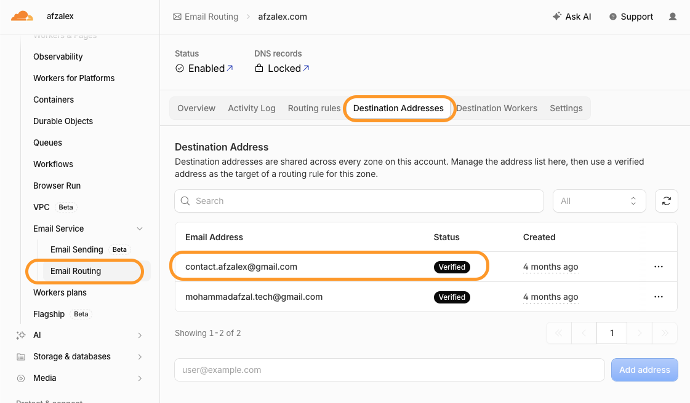
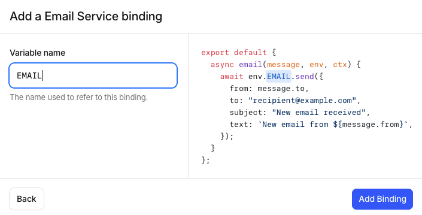
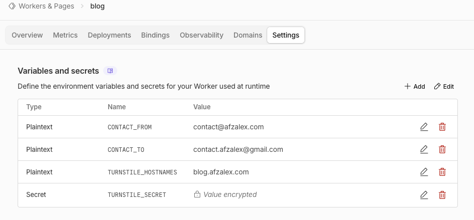
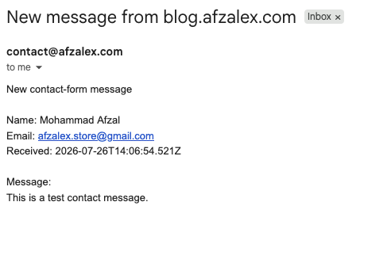
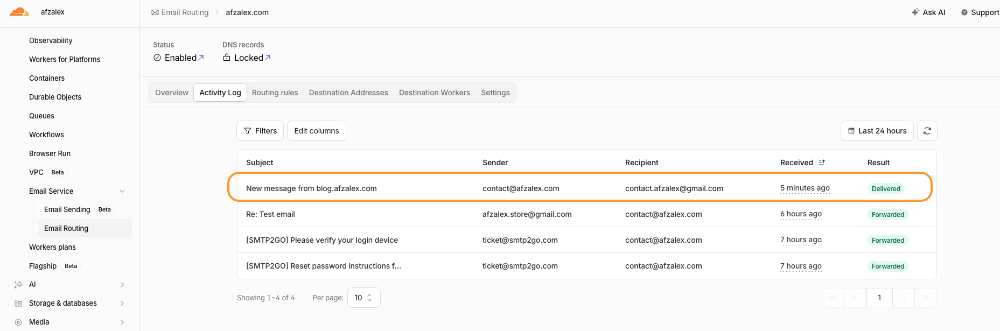

A website form becomes useful only when its submissions reach somebody.

That form might be labelled **Contact us**, **Send an enquiry**, **Report a problem**, **Submit a complaint**, or **Request a callback**. The labels change, but the delivery problem is the same: a public browser needs to pass untrusted input to a trusted backend, and the backend needs to put an understandable notification in the right inbox.

My Astro blog is statically generated and hosted without an application server. I wanted its contact form to deliver messages to Gmail without adding a paid form provider or exposing mail credentials in the browser.

The setup that worked uses:

```text
Website form
  - Cloudflare Turnstile
  - Cloudflare Worker
  - Cloudflare Email Service binding
  - verified Gmail destination
```

The Worker is the important boundary. It decides which website may submit, validates the fields, verifies Turnstile, fixes the sender and recipient, and sends the message.

## Requirements before starting

This article begins after a few account-level pieces are ready:

1. **A domain managed through Cloudflare.** The sender address must belong to a domain onboarded to Cloudflare Email Service.
2. **Email Routing enabled.** Cloudflare requires at least one verified destination address before a Worker email binding can send to it.
3. **A verified destination inbox.** This is the real mailbox where notifications will arrive, such as a Gmail address.
4. **A Turnstile widget.** The frontend needs its public site key, while the Worker needs the secret.
5. **A web form.** It needs at least a name, reply address, and message, although the same pattern works for order references, complaint categories, phone numbers, and similar fields.

I covered the Turnstile setup separately in [Cloudflare Turnstile: A Smarter, Free Alternative to CAPTCHA](/blog/cloudflare-turnstile-a-smarter-free-alternative-to-captcha/). That article explains why the visible widget and server-side Siteverify call are both necessary.

Cloudflare Email Routing keeps verified destinations under:


**`Compute > Email Service > Email Routing > Destination Addresses`**


I had already verified the Gmail inbox that would receive the form notifications.



Verification matters for both security and pricing. A Worker email binding with no recipient allowlist can send only to verified destination addresses in the account. Cloudflare's current pricing also makes these sends free, including when the account is using only Email Routing.

## Create the Worker endpoint

Because the website is static, I created a small Cloudflare Worker to act as its form endpoint:

**`Compute > Workers & Pages > Create application > Start with Hello World`**

I named the Worker `blog`, which gave it this endpoint:

```text
https://blog.afzalex.workers.dev
```

The Worker does not host or render the blog. It has one narrow job: accept a valid form submission and turn it into an email.

Opening that URL directly sends a `GET` request. My Worker answers it with:

```json
{
  "ok": false,
  "message": "Method not allowed."
}
```

That response is expected. The endpoint accepts form submissions with `POST`, plus `OPTIONS` for browser CORS preflight.

## Add the Email Service binding

On the Worker's **Bindings** tab, I selected:

```text
Add binding
→ Email Service
```

I named the binding:

```text
EMAIL
```



The name is not decorative. It becomes the property used by the Worker:

```js
await env.EMAIL.send(...)
```

Changing the dashboard name requires changing the code as well.

For a form that always delivers to one inbox, the recipient should never come from browser input. My code reads it from Worker configuration, and Cloudflare additionally restricts unrestricted bindings to verified destination addresses. A binding may also be configured with a fixed `destination_address` or an `allowed_destination_addresses` list for a tighter platform-level restriction.

## Configure variables and the secret

Under **Settings → Variables and secrets**, I added:

```text
CONTACT_FROM          contact@afzalex.com
CONTACT_TO            contact.afzalex@gmail.com
TURNSTILE_HOSTNAMES   blog.afzalex.com
TURNSTILE_SECRET      encrypted secret
```



The first three values are ordinary runtime configuration. `TURNSTILE_SECRET` must be stored with the **Secret** type so the dashboard encrypts it and does not expose its value after saving.

Each value has a distinct purpose:

| Setting | Purpose |
| --- | --- |
| `CONTACT_FROM` | A sender on my Cloudflare-onboarded domain |
| `CONTACT_TO` | The fixed, verified inbox that receives notifications |
| `TURNSTILE_HOSTNAMES` | The production website allowed to call the Worker |
| `TURNSTILE_SECRET` | The private credential used for Siteverify |

The frontend receives neither `CONTACT_TO` nor `TURNSTILE_SECRET`. Visitors cannot choose a recipient, and they cannot verify their own Turnstile token.

## Give the three email addresses different jobs

A form submission contains three email identities, and mixing them up causes security or deliverability problems:

```text
From       contact@afzalex.com
To         contact.afzalex@gmail.com
Reply-To   visitor@example.com
```

- **From** is controlled by the Worker and belongs to the onboarded domain.
- **To** is controlled by the Worker and points to the verified destination.
- **Reply-To** comes from the validated form field.

I do not place the visitor's address in `From`. Cloudflare has not verified that visitor's domain, and pretending to send as somebody else's address would conflict with modern email authentication. `Reply-To` expresses the real intention: the notification came from my website, but clicking **Reply** should address the person who filled in the form.

## Validate before sending

The Worker rejects requests before email delivery when:

- the HTTP method is not `POST`;
- the browser origin is not an allowed HTTPS hostname;
- required Worker configuration is missing;
- the request is too large;
- a field is empty or longer than its limit;
- the reply address is malformed;
- the Turnstile token is missing, expired, invalid, or too large;
- Siteverify reports the wrong action or hostname.

The core ordering is deliberate:

```text
Check request
- parse form
- validate fields
- verify Turnstile
- send email
- return success
```

The email call must remain after every validation gate:

```js
const form = await request.formData();

const name = requiredText(form, "name", 100);
const email = requiredText(form, "email", 254);
const message = requiredText(form, "message", 5_000);
const token = form.get("cf-turnstile-response");

if (
  !name ||
  !email ||
  !validEmail(email) ||
  !message ||
  typeof token !== "string" ||
  !token
) {
  return Response.json(
    {
      ok: false,
      message: "Please complete every field and the security check.",
    },
    { status: 400 },
  );
}
```

The Worker then verifies the Turnstile token from the browser:

```js
const verificationResponse = await fetch(
  "https://challenges.cloudflare.com/turnstile/v0/siteverify",
  {
    method: "POST",
    headers: {
      "Content-Type": "application/x-www-form-urlencoded",
    },
    body: new URLSearchParams({
      secret: env.TURNSTILE_SECRET,
      response: token,
      remoteip: request.headers.get("CF-Connecting-IP") || "",
    }),
  },
);

const result = await verificationResponse.json();

if (
  result.success !== true ||
  result.action !== "turnstile-spin-v2" ||
  result.hostname !== "blog.afzalex.com"
) {
  return Response.json(
    { ok: false, message: "The security check failed. Please try again." },
    { status: 403 },
  );
}
```

If the widget fails, the browser should stop before making the request. The Worker still performs its own check because browser JavaScript can be bypassed. A failed, missing, expired, or reused token must never reach `env.EMAIL.send()`.

## Build a useful notification

After validation and Siteverify succeed, the Worker sends a plain-text notification:

```js
await env.EMAIL.send({
  to: env.CONTACT_TO,
  from: env.CONTACT_FROM,
  replyTo: email,
  subject: "New message from blog.afzalex.com",
  text: [
    "New contact-form message",
    "",
    `Name: ${name}`,
    `Email: ${email}`,
    `Received: ${new Date().toISOString()}`,
    "",
    "Message:",
    message,
  ].join("\n"),
});
```

Plain text is enough for this use case. It is easy to inspect, difficult to style deceptively, and avoids rendering arbitrary visitor HTML in the inbox.

For a complaint or support form, the same message could include fixed fields such as:

```text
Category: Billing
Reference: INV-1042
Priority: Normal
```

Those values still need server-side validation. A dropdown in the browser is a convenience, not a trust boundary.

## Connect the static form to the Worker

My Astro form points its action at the Worker:

```html
<form
  action="https://blog.afzalex.workers.dev"
  method="post"
  data-contact-form
>
  <!-- labelled name, email, and message fields -->
  <!-- Turnstile widget -->
  <button type="submit">Send</button>
</form>
```

JavaScript submits `FormData`, which automatically contains the Turnstile-generated `cf-turnstile-response` field:

```js
form.addEventListener("submit", async (event) => {
  event.preventDefault();

  const formData = new FormData(form);
  const token = formData.get("cf-turnstile-response");

  if (typeof token !== "string" || !token) {
    showStatus("Please complete the security check.");
    return;
  }

  const response = await fetch(form.action, {
    method: "POST",
    headers: { Accept: "application/json" },
    body: formData,
  });

  const result = await response.json();
  showStatus(result.message);
});
```

The real page also disables the button while sending, announces status through an `aria-live` region, resets the form after success, and resets Turnstile after every attempt so a retry receives a fresh token.

## CORS should be narrow

The website and Worker use different origins:

```text
Website   https://blog.afzalex.com
Worker    https://blog.afzalex.workers.dev
```

The Worker therefore returns:

```http
Access-Control-Allow-Origin: https://blog.afzalex.com
Vary: Origin
```

It does not return `Access-Control-Allow-Origin: *`.

CORS is not a replacement for Turnstile or validation, but a narrow allowlist prevents ordinary browser pages on unrelated domains from using the endpoint. The same configured hostname is also checked against the hostname returned by Siteverify.

## Test the whole path

I tested the production form rather than treating the green Turnstile check as proof of email delivery:

1. Submit valid fields and a completed Turnstile challenge.
2. Confirm that the page reports success only after the Worker returns `200`.
3. Open the destination inbox and inspect the sender, visitor address, timestamp, and message.
4. Select **Reply** and confirm that Gmail addresses the visitor from `Reply-To`.
5. Check Cloudflare's activity or sending logs for the delivery result.

The final message arrived in Gmail from `contact@afzalex.com`, with the visitor's submitted address preserved in the body and as the reply target.



Cloudflare also recorded the Worker-generated message as **Delivered** to the verified destination.



I also tested failure paths: a direct `GET`, an unexpected origin, missing Turnstile data, an invalid reply address, and a failed Siteverify response. None of them called the email binding.

## What is free, and what is not

Cloudflare currently allows a Worker to send to verified destination addresses free of charge on all plans, including accounts configured only for Email Routing. Those sends do not count against the arbitrary-recipient Email Sending quota.

That makes this fixed-inbox pattern a good fit:

```text
Many website visitors
  → one protected Worker
  → one verified destination inbox
```

It does **not** mean the Worker can act as a free general-purpose mail server. Sending to arbitrary recipients is a different Email Sending capability with its own plan and quota. Cloudflare's abuse controls and the normal Workers limits also still apply.

The form submission does not use Gmail's sending quota and does not use SMTP2GO. Gmail is only the destination mailbox for this path. If I later reply from Gmail as `contact@afzalex.com`, that reply uses whichever SMTP service is configured for Gmail's **Send mail as** feature.

Cloudflare documents the current details under [Email Service pricing](https://developers.cloudflare.com/email-service/platform/pricing/), [send binding configuration](https://developers.cloudflare.com/email-service/configuration/send-bindings/), and the [Workers email API](https://developers.cloudflare.com/email-service/api/send-emails/workers-api/).

## A small backend with a clear responsibility

The finished system separates responsibilities cleanly:

- the static site collects and displays form state;
- Turnstile produces evidence about the browser interaction;
- the Worker verifies that evidence and validates untrusted fields;
- the Email Service binding delivers only after the checks pass;
- Gmail stores the notification and replies to the visitor.

That pattern is useful beyond a page named **Contact**. It can carry support requests, corrections, complaints, booking enquiries, feedback, and other low-volume website submissions.

The essential rule stays the same: the browser may request delivery, but only the backend may decide that a message is safe and valid enough to send.
