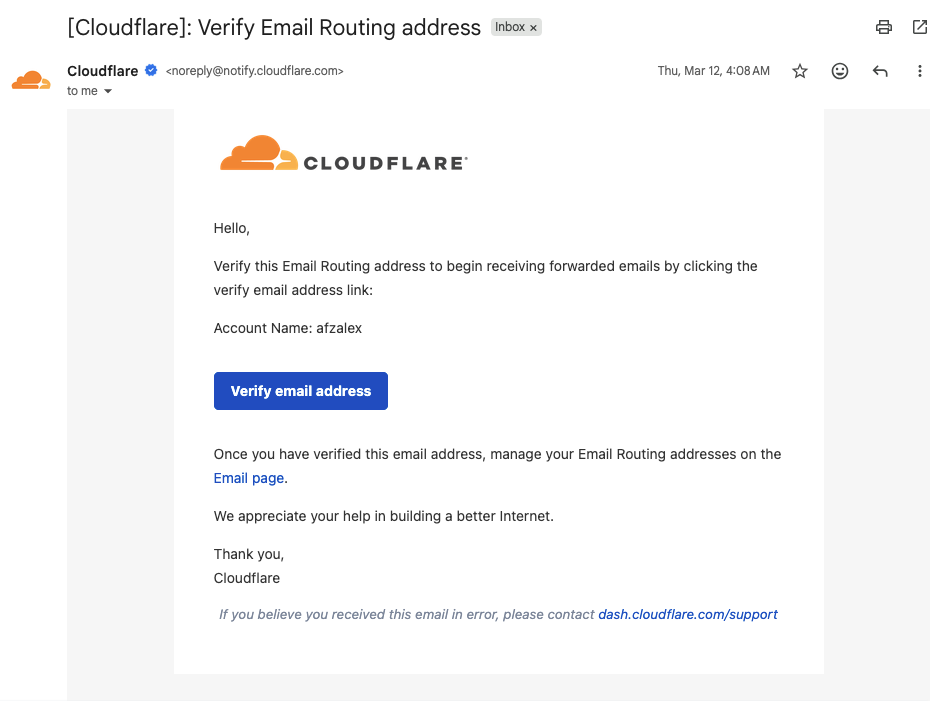
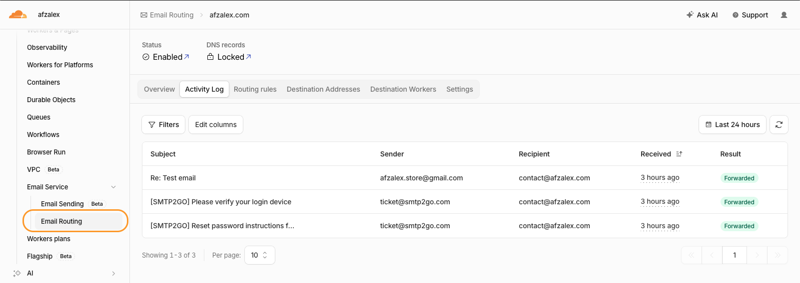
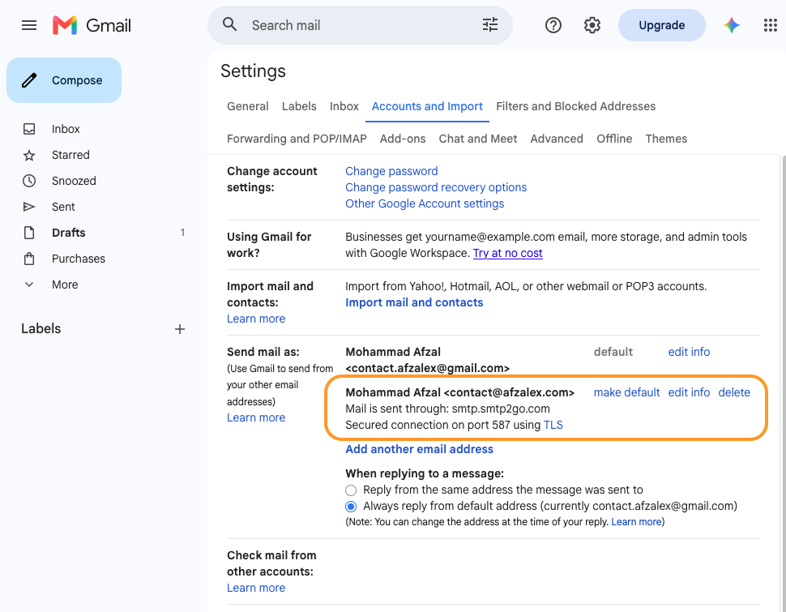
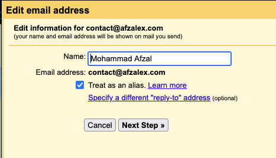
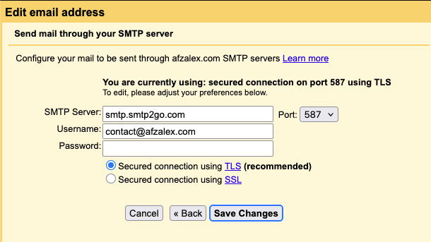
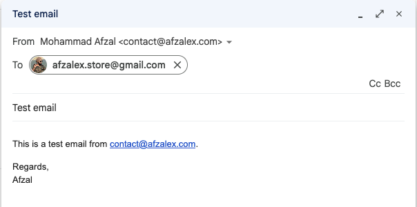
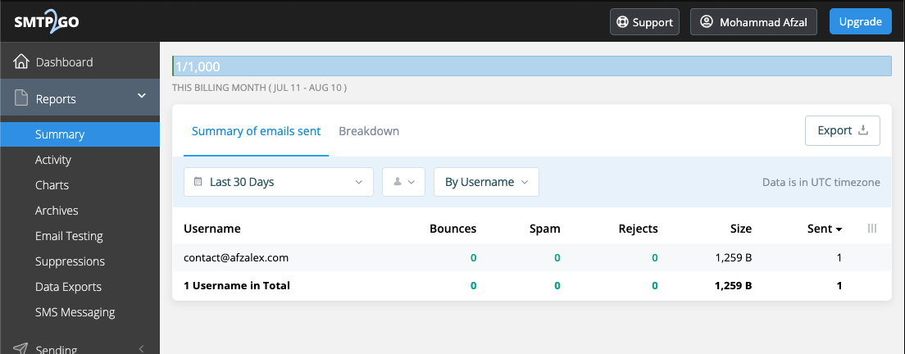
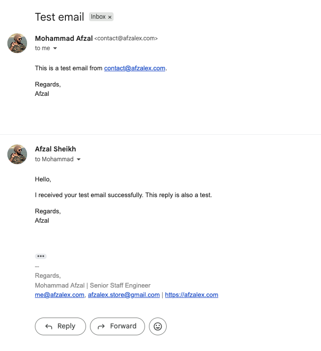

I wanted a professional email address on my own domain:

```text
contact@afzalex.com
```

I also wanted to keep using the Gmail interface I already know, without paying for Google Workspace or maintaining a complete mail server at home.

The setup that worked for me combines three services:

```text
Incoming mail
contact@afzalex.com → Cloudflare Email Routing → personal Gmail inbox

Outgoing mail
Gmail → SMTP2GO → recipient
```

Gmail remains the inbox and writing interface. Cloudflare forwards incoming messages, and SMTP2GO provides the authenticated SMTP server that delivers outgoing messages from my domain.

None of these services alone does the whole job. Understanding that separation made the setup much easier.

## What this setup provides

After finishing, I can:

- receive messages addressed to `contact@afzalex.com` in Gmail;
- select `contact@afzalex.com` in Gmail's **From** field;
- receive replies at the same custom address;
- authenticate outgoing messages with my domain;
- continue using Gmail on the web and mobile applications.

It is not a separate Gmail mailbox. Cloudflare does not store the inbox, and Gmail does not host `afzalex.com`. The custom address is a route into my existing Gmail account plus an authenticated identity for outgoing mail.

## Part one: receive mail with Cloudflare

[Cloudflare Email Routing](https://developers.cloudflare.com/email-service/get-started/route-emails/) forwards mail from a custom address to an existing inbox. It is available on Cloudflare's free plan, but the domain must use Cloudflare DNS.

In the Cloudflare dashboard, I opened:

```text
Compute → Email Service → Email Routing
```

I onboarded `afzalex.com` and allowed Cloudflare to create the required MX and authentication records.

This step changes where incoming mail for the domain is delivered. If a domain already has mailboxes with another provider, replacing its MX records would interrupt that service. In my case, Cloudflare Email Routing was the intended receiver.

### Verify the destination inbox

Before Cloudflare forwards mail, the destination Gmail address must be verified.

I added my Gmail address under **Destination Addresses**, then opened the verification message that Cloudflare sent and selected **Verify email address**.



Only verified destinations can be selected in routing rules. This protects someone from silently forwarding a domain's mail to an unrelated inbox.

### Create the routing rule

I then created a custom-address rule:

```text
Custom address: contact@afzalex.com
Action: Send to an email
Destination: my verified Gmail address
```

After saving it, I sent a message to `contact@afzalex.com` from a different email account. It arrived in Gmail through Cloudflare.

Testing from a different account matters. Forwarding systems can treat a message differently when its sender and final destination are the same mailbox.

Cloudflare's Activity Log confirmed both the health of the domain configuration and the result of individual messages. It showed that Email Routing was enabled, its DNS records were locked in place, and SMTP2GO's account messages were successfully forwarded to `contact@afzalex.com`.



## Part two: send mail through SMTP2GO

Email forwarding solves only the receiving side. Gmail still needs an SMTP server authorized to send mail for `afzalex.com`.

I used [SMTP2GO](https://www.smtp2go.com/) for this. Its free plan currently permits 1,000 messages per month, with a limit of 200 per day. That is sufficient for ordinary personal correspondence and low-volume contact mail, but it is not an unlimited newsletter service.

### Verify the complete sender domain

Inside SMTP2GO, I opened:

```text
Sending → Verified Senders → Sender Domains
```

I added `afzalex.com`. SMTP2GO displayed the DNS records required to authenticate the domain.

I added the records exactly as supplied to Cloudflare DNS. Any CNAME records used for mail authentication should remain **DNS only**, not proxied through Cloudflare.

Verifying the domain is better than verifying only one sender address. Domain verification allows SMTP2GO to align the message's SPF and DKIM authentication with `afzalex.com`, which improves deliverability and avoids the weaker “sent via another domain” presentation.

The exact DNS values are account-specific, so they should be copied from the SMTP2GO dashboard rather than from somebody else's tutorial.

One DNS rule is universal: a hostname must not have multiple independent SPF TXT records beginning with `v=spf1`. If another sending service also needs SPF authorization, its mechanism must be merged into the existing record instead of publishing a second one.

### Create dedicated SMTP credentials

Next, I opened:

```text
Sending → SMTP Users
```

I created a dedicated SMTP user and saved its generated username and password.

These credentials are not the same as the SMTP2GO website password. They should be treated like an application password: never publish them, put them in screenshots, or reuse them for another service.

The SMTP hostname should come from the provider's current dashboard or setup instructions. My working Gmail configuration used:

```text
Server: smtp.smtp2go.com
Port: 587
Security: TLS
Username: contact@afzalex.com
Authentication: dedicated SMTP password
```

## Part three: add the address to Gmail

Gmail calls this feature **Send mail as**.

On Gmail's desktop website, I opened:

```text
Settings
→ See all settings
→ Accounts and Import
→ Send mail as
→ Add another email address
```

The **Send mail as** section lists the custom address, its SMTP route, and the choices that control which address Gmail uses for replies.



I entered my display name and:

```text
contact@afzalex.com
```

Because this address belongs to me and delivers into the same Gmail inbox, I left **Treat as an alias** enabled.



On the SMTP screen, I entered:

```text
SMTP server: smtp.smtp2go.com
Port: 587
Username: contact@afzalex.com
Password: the SMTP2GO SMTP password
Connection: Secured connection using TLS
```



Gmail then sent a confirmation message to `contact@afzalex.com`. Cloudflare forwarded it into my Gmail inbox, where I opened the message and confirmed the address.

This one verification message proves that I control both sides: the custom address can receive mail, and Gmail is allowed to use it as a sender.

## Configure replies correctly

Adding the address changes what Gmail can place in the **From** field, but I also checked the reply behavior.

Under **Accounts and Import**, **Edit info** beside the custom address can set an explicit reply-to address:

```text
contact@afzalex.com
```

The screenshot above captures **Always reply from default address** selected. That is valid, but it means replies use the underlying Gmail identity unless I change the sender manually. To keep conversations consistently on the domain, I can instead select **Reply from the same address the message was sent to**.

I can make the custom address the default sender, or choose it only when a message should represent the domain.

## Test the complete path

I tested outgoing and incoming mail as one round trip, using a second Gmail account as the recipient:

```text
contact@afzalex.com → second Gmail account
second Gmail account → reply to contact@afzalex.com
contact@afzalex.com → Cloudflare → original Gmail inbox
```

For the first half, I selected `contact@afzalex.com` in Gmail's **From** field, addressed the message to the second account, and sent a short test:



The SMTP2GO report recorded the successful delivery with no bounce, spam complaint, or rejection. It also showed one message counted against the free-plan quota.



The recipient then replied to the message. That reply was addressed to `contact@afzalex.com`, passed through Cloudflare Email Routing, and appeared back in my original Gmail inbox.



The conversation shows the custom-domain sender and the reply. The Cloudflare and SMTP2GO logs above independently verify the two delivery routes.

That verifies both directions:

```text
Gmail → SMTP2GO → recipient
recipient → contact@afzalex.com → Cloudflare → Gmail
```

For an authentication check, I also opened the received message's original headers and confirmed that SPF, DKIM, and DMARC passed. Delivery proves the route works; aligned authentication makes it dependable across different receiving providers.

## What is free—and what is limited

This arrangement costs nothing beyond owning the domain:

| Component | Purpose | Free-plan role |
| --- | --- | --- |
| Cloudflare Email Routing | Receive and forward mail | Forwards the custom address to Gmail |
| Gmail | Inbox and writing interface | Stores mail and provides Send mail as |
| SMTP2GO | Outgoing SMTP delivery | 1,000 messages per month, 200 per day |

Free plans can change, so I would check the provider's current limits before depending on this for a business-critical mailbox.

There are also practical differences from a paid hosted mailbox:

- Cloudflare forwards mail; it is not the permanent mailbox.
- SMTP2GO supplies delivery infrastructure, not an inbox.
- Gmail filters and automated replies can sometimes expose the underlying Gmail identity.
- Outgoing delivery stops if the SMTP2GO quota is exhausted.
- This low-volume setup is not a substitute for a consent-based newsletter platform.

For a personal contact address or a small website, those tradeoffs are reasonable. For multiple employees, shared mailboxes, calendars, compliance requirements, or guaranteed support, a hosted mail provider is the more appropriate tool.

## The useful mental model

The most important part of this setup is recognizing that receiving and sending are independent:

```text
MX records decide who receives mail.
An SMTP provider decides who can send it.
Gmail provides the interface.
SPF, DKIM, and DMARC establish trust.
```

Once those responsibilities are separated, a custom-domain address no longer requires either an expensive suite or a fragile home mail server.

I now receive and send as `contact@afzalex.com` from the Gmail interface, while Cloudflare and SMTP2GO handle the two pieces Gmail's free personal account does not provide.
